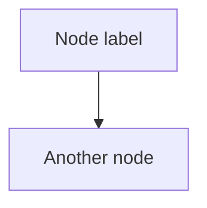
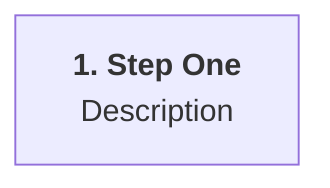
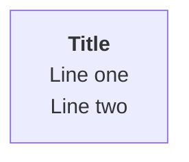
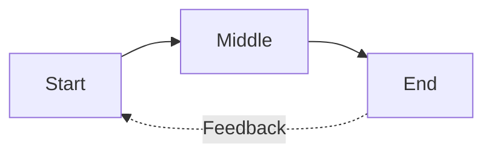

# Mermaid Diagram Style Guide

Add new Mermaid diagrams (flowcharts, timelines, process diagrams) to `mermaid/`.
Each diagram is a Markdown file containing a ` ```mermaid ` code block.

## File conventions

| Item | Convention |
|---|---|
| Directory | `mermaid/` |
| EN source | `topic.md` |
| NL source | `topic_NL.md` |
| Output | `mermaid-output/{stem}.svg` and `{stem}.png` |

Every diagram that supports text labels must have both an English and Dutch
version. The Dutch filename ends with `_NL`.

## Source file format

```markdown
---
title: Short Title — Subtitle
description: >
  One-paragraph description of the diagram contents.
---

```

- **Frontmatter** (optional but recommended): `title` and `description` fields.
- **Code block**: A single ` ```mermaid ` fenced block containing the diagram.

## Styling

All diagrams use the Bitroot theme derived from `bitroot.json`. The theme is
applied automatically by `generate_mermaid.py` — do not hardcode colours in the
Mermaid source.

### Theme variables

| Mermaid variable | Bitroot token | Role |
|---|---|---|
| `primaryColor` | `surface-elev` | Default node fill |
| `primaryTextColor` | `on-surface` | Node label text |
| `primaryBorderColor` | `primary` | Node border (cyan) |
| `lineColor` | `secondary` | Connector lines / arrows |
| `secondaryColor` | `tertiary` | Secondary node fill |
| `tertiaryColor` | `surface` | Tertiary node fill |

### Highlighted text

Use `<b class='hl'>text</b>` inside node labels to apply the primary (cyan)
accent colour with bold weight. Use this for step numbers, key terms, or
headings within nodes:



### Node types

| Syntax | Shape | Use |
|---|---|---|
| `[Label]` | Rectangle | Standard process step |
| `(["Label"])` | Rounded | Start/end nodes |
| `["Label"]` | Stadium | Terminal states |
| `{Label?}` | Diamond | Decision points |
| `("Label")` | Cylinder | Data storage |

### Flowchart direction

| Direction | When to use |
|---|---|
| `flowchart TD` | Hierarchical trees, decision flows, top-down processes |
| `flowchart LR` | Timelines, linear sequences, left-to-right flows |
| `flowchart TB` | Same as TD (alias) |

### Line breaks

Use `<br/>` inside node labels for multi-line content:



### Dashed / annotated edges

Use dashed edges for feedback loops, secondary relationships, or
non-primary flows:



## Rendering

Regenerate only the specific files you created or modified. Do **not** render
every diagram in `mermaid/` — only the relevant ones:

```bash
python generate_mermaid.py new_diagram.md new_diagram_NL.md
```

This writes `{stem}.svg` and `{stem}.png` to `mermaid-output/`.

## README update

After creating new diagrams, add entries to the Mermaid Diagrams table in
`README.md`:

```markdown
| `new_diagram.md` | EN | `{stem}.svg`, `{stem}.png` |
| `new_diagram_NL.md` | NL | `{stem}.svg`, `{stem}.png` |
```
