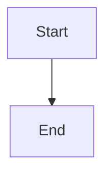

# Mermaid Diagram Style Instructions

## Shared design foundation
All visuals in this repository share ONE source of truth: `CCPlots/config/bitroot.json`.
Do NOT hard-code hex values in Mermaid sources — always reference the theme layer
(`CCPlots/config/mermaid_theme.py`), which is derived from `bitroot.json` and passed
to the `mmdc` CLI at render time via `generate_mermaid.py`.

If you need inline styling within a diagram (e.g. coloured text in a flowchart node),
use the primary hex `#269FBA` sparingly — only when the theme's global variables
cannot achieve the effect. See "Diagram-level styling" below.

## Theme architecture

| Layer | File | Role |
|---|---|---|
| Source of truth | `CCPlots/config/bitroot.json` | All hex values, typography, spacing |
| Theme builder | `CCPlots/config/mermaid_theme.py` | Maps palette to `mmdc`-compatible JSON (`get_mermaid_theme()`) |
| Renderer | `generate_mermaid.py` | Extracts ` ```mermaid ` blocks from `.md` files, passes theme to `mmdc` |

Theme variable mapping (also documented in `mermaid_theme.py`):

| Mermaid variable | Bitroot key | Role |
|---|---|---|
| `background` | `surface` | Page background |
| `primaryColor` | `surface-elev` | Default node fill |
| `primaryTextColor` | `on-surface` | Node label text |
| `primaryBorderColor` | `primary` | Node border (cyan) |
| `lineColor` | `secondary` | Connector lines / arrows (purple) |
| `secondaryColor` | `tertiary` | Secondary node fill (green) |
| `secondaryTextColor` | `on-surface` | Secondary node label text |
| `tertiaryColor` | `surface` | Tertiary node fill |
| `tertiaryTextColor` | `on-surface-muted` | Tertiary node text |
| `edgeLabelBackground` | `white` | Edge label background |
| `fontFamily` | — | `Inter, system-ui, sans-serif` |

All colours are resolved at render time — never embed hex values in diagram source
unless the theme variables cannot express the desired styling.

## Directory & file conventions

| Location | Purpose |
|---|---|
| `mermaid/*.md` | Source files (one per diagram) |
| `mermaid-output/*.svg` | Rendered vector output (auto-generated) |
| `mermaid-output/*.png` | Rendered bitmap output (auto-generated) |

### File naming
- **EN:** `topic.md` (no language suffix)
- **NL:** `topic_NL.md` (append `_NL` before `.md`)
- Use kebab-case for multi-word topics: `eu_ai_act_timeline.md`

### Localization convention
For every EN diagram that contains text, create an NL counterpart. Both files use
exactly the same diagram structure — only the label text changes. The renderer
(`generate_mermaid.py`) processes every `.md` file in `mermaid/` automatically, so
the output files appear in `mermaid-output/` with matching names.

## Workflow for adding a new diagram

1. Create `mermaid/<topic>.md` (EN) with a ` ```mermaid ` code block.
   - Optionally add YAML front matter (title, description) for source-code documentation.
     Front matter is ignored by the renderer.
2. Create `mermaid/<topic>_NL.md` (NL) with the same diagram and translated labels.
3. Run `python generate_mermaid.py` from the project root.
4. Verify the SVG and PNG outputs appear in `mermaid-output/`.

Example source skeleton (`mermaid/my_topic.md`):
```markdown
---
title: My Topic — Diagram
description: >
  Brief description visible only in source code. Explains what the diagram
  shows and which audience it targets.
---

```

## Diagram type selection

| Type | Use for | Slide-friendly |
|---|---|---|
| `flowchart TD` / `flowchart LR` | Process flows, decision trees, timelines | Yes — compact, respects theme variables |
| `sequenceDiagram` | Message passing, API flows | Yes |
| `classDiagram` | OOP/type hierarchies | Yes |
| `gantt` | Project timelines | Wide — use sparingly on slides |
| `timeline` | Chronological timelines | **Avoid** — does NOT respect theme variables (uses internal HSL cycling) |

**Rule of thumb:** Use `flowchart` variants when in doubt. They have the best theme
variable support and produce the most consistent Bitroot-styled output.

## Diagram-level styling

The theme JSON sets global defaults. When you need per-element control:

### Bold / colour on specific text
Use the predefined `.hl` CSS class (defined in `mermaid_theme.py` via `themeCSS`)
to highlight text in the primary (cyan) colour:
```
A["<b class='hl'>2024</b><br>description"]
```
The `.hl` class is available in every diagram because `get_mermaid_theme()` injects
it into the SVG via `themeCSS`. Do NOT hard-code hex values inside `style` attributes
in diagram source files — if you need a new reusable class, add it to the
`themeCSS` string in `mermaid_theme.py` instead.

### Node shape selection
- `[text]` — rectangle (default, good for general use)
- `([text])` — stadium/pill (use sparingly for emphasis)
- `{text}` — rhombus/diamond (decisions)
- `((text))` — circle (start/end nodes)

### Styling caveats
- Only `flowchart` and `graph` diagram types reliably inherit all theme variables.
- `timeline` sections use internal HSL colour cycling and ignore `primaryColor`,
  `secondaryColor`, etc. — use `flowchart LR` instead.
- Inline `<b style="...">` works via SVG `foreignObject` rendering. Test after adding.

## Content guidelines for slides

- **One concept per diagram** — keep it focused.
- **Compact node labels** — max 6-8 words per node. Use `<br>` for multi-line text.
- **Max 7-8 nodes** in a `flowchart LR` (horizontal) to fit on a slide.
- **Max 5-6 levels** in a `flowchart TD` (vertical).
- Use **Description** in YAML front matter to document the diagram's intent without
  cluttering the rendered output.
- Avoid emojis in diagram text (per Bitroot design guidelines — only permitted in
  editorial content, not functional diagrams).

### Slide-friendly preference

Prefer compact diagrams that fit on a presentation slide (max 7-8 nodes, 2-3 levels deep).
This ensures diagrams remain readable when projected and leaves room for speaker notes.

When a topic requires more detail (e.g. reference documentation, complex hierarchies),
create a **compact version** for slides alongside a **detailed version** for other uses.
Name the detailed version with a `_detailed` suffix (e.g. `topic_detailed.md`).

## Verification
- Run `python generate_mermaid.py` to regenerate all diagrams.
- Run `python generate_mermaid.py topic.md topic_NL.md` to regenerate specific files.
- Check that both SVG and PNG were created in `mermaid-output/`.
- Verify the SVG uses the expected Bitroot palette:
  - Background: `#F8FAFA` (surface)
  - Node fill: `#EDF1F1` (surface-elev)
  - Node border: `#269FBA` (primary)
  - Text: `#2D3333` (on-surface)
  - Arrow/lines: `#5C78D9` (secondary)
- Update `README.md` with the new source/output entries in the Mermaid table.
