# BitRoot AI Visuals

Teaching-focused plots and learning materials for AI and machine learning courses.

## About

This repository generates plots, diagrams, and code snippets used in AI course
materials. All plots are generated programmatically via the `CCPlots` Python module,
ensuring consistent styling from the Bitroot design palette.

## Contents

- [Python Plots](#python-plots) — generated with CCPlots
- [Mermaid Diagrams](#mermaid-diagrams) — `.md` / `.svg` / `.png`
- [Code Snippets](#code-snippets) — ray.so renders (old style)
- [Plot Showcase](#plot-showcase)

## Python Plots

The `CCPlots` module generates all plots in `plots/`.

1. Install dependencies: `pip install -r requirements.txt`
2. Regenerate all plots: `python generate_plots.py`
3. Or run a single example: `python -c "import CCPlots; CCPlots.<ClassName>().main()"` (see table below for class names)

Every example is a subclass of `PlotExample` (defined in `CCPlots/PlotExample.py`)
with a `CONFIG_KEY` that links it to its JSON config in `CCPlots/plot_configs/`.
All examples can be run via `generate_plots.py` uniformly.

### Configuration-driven

Each plot is configured by a JSON file in `CCPlots/plot_configs/`:
- Output filenames, figure size, DPI
- Locale-specific text labels (``text`` section)
- Semantic colour mappings (``colors`` section, optional)
- Plot-specific parameters (``params``, ``run`` sections)

To change a label or colour, edit the JSON — no Python code changes needed.

A global random seed (`GLOBAL_RANDOM_STATE = 42` in `CCPlots/config/`) is
used consistently by all examples for numpy, sklearn, and Python random calls.

### Localization

Every plot that supports text labels produces an English (EN) and Dutch (NL)
version. The EN filename has no suffix; the NL filename ends with `_NL`.
Text labels are stored in each plot's JSON config under a ``text`` key with
locale pairs `("en", "nl")`.

### Implementations

| Class | Config | Output |
|---|---|---|
| `Classification` | `classification.json` | `classification_decision_boundary.png`, `classification_confusion_matrix.png` |
| `ContinuousDiscrete` | `continuous_discrete.json` | `continuous_discrete.png` |
| `DecisionTree` | `decision_tree.json` | `decision_tree_iris.png` |
| `EmployeeAIAdoption` | `employee_ai_adoption.json` | `employee_ai_adoption.png` |
| `FraudDetection` | `fraud_detection.json` | `fraud_detection_boundary.png` |
| `KFolds` | `kfolds.json` | `kfold_validation.png` |
| `KMeans` | `kmeans.json` | `kmeans_animation_k3.gif`, `kmeans_clustering_k3.png` |
| `KNearest` | `knearest.json` | `knn_visualization_animation.gif` |
| `LLMPredict` | `llm_predict.json` | `llm_predict_next.png` |
| `LinearRegression` | `linear_regression.json` | `linear_regression_animation.gif` |
| `LogisticRegression` | `logistic_regression.json` | `logistic_regression_animation.gif` |
| `MSE` | `mse.json` | `mse_over_iterations.png` |
| `MSEZoom` | `mse_zoom.json` | `mse_zoom_iteration.png` |
| `MissingData` | `missing_data.json` | `missing_data_table.png` |
| `MultivariateRegression` | `multivariate_regression.json` | `multivariate_regression_animation.gif` |
| `NeuralNetSchematic` | `neural_net_schematic.json` | `neural_net_schematic.png` |
| `NeuralNetworkActivationFunctions` | `neural_network_activation_functions.json` | `neural_network_activation_functions.png` |
| `NeuralNetworkGrowth` | `neural_network_growth.json` | `neural_network_growth_line_log.png` |
| `NoisyData` | `noisy_data.json` | `noisy_data.png` |
| `NormalDistribution` | `normal_distribution.json` | `normal_distribution.png` |
| `OverfittingUnderfitting` | `overfitting_underfitting.json` | `overfitting_underfitting.png` |
| `Perceptron` | `perceptron.json` | `perceptron_schematic.png` |
| `Tokenization` | `tokenization.json` | `tokenization.png` |
| `TravelingSalesman` | `traveling_salesman.json` | `traveling_salesman_small_<n>_cities.png`, `traveling_salesman_large_<n>_cities.png` |

## Mermaid Diagrams

The `mermaid/` folder stores Mermaid diagram source (`.md`), rendered SVG,
and PNG exports. Diagrams are styled with the Bitroot theme derived from
`bitroot.json` and rendered via the Mermaid CLI.

1. Install Node dependencies: `npm install`
2. Regenerate all diagrams: `python generate_mermaid.py`

### Available diagrams

| File | Topic | Locales |
|---|---|---|
| `eu_ai_act_classification_NL.md` | EU AI Act risk classification (NL) | NL |
| `eu_ai_act_classification.md` | EU AI Act risk classification (EN) | EN |
| `ml_algorithms_overview.md` | Machine learning overview tree | EN |
| `ml_algorithms.md` | Full ML algorithm breakdown | EN |
| `scientific_method.md` | Scientific method flowchart | EN |

## Code Snippets

The `code-snippets/` folder contains code snippet screenshots generated with
[ray.so](https://ray.so). These accompany the course slides.

Settings: Theme `meadow`, Background off, Margin 16px, Languages Python / Markdown.

### Subdirectories

| Folder | Contents |
|---|---|
| `algorithms/` | sklearn API examples (clustering, trees, regression, SVM, etc.) |
| `exercise_snippets/` | Starter code for exercises (e.g. Titanic import) |
| `finetuning/` | Grid search / hyperparameter tuning examples |
| `model_selection/` | LazyPredict comparison output |
| `preprocessing/` | Data cleaning, binning, normalization, encoding, etc. |

## Styling

All visuals (plots and Mermaid diagrams) follow the **Bitroot** palette
defined in [`CCPlots/config/bitroot.json`](CCPlots/config/bitroot.json),
the single source of truth derived from the Bitroot design system.

| Token | Hex | Role |
|---|---|---|
| `primary` | `#269FBA` | Brand accent / node borders |
| `secondary` | `#5C78D9` | Connector lines / arrows |
| `tertiary` | `#A3D979` | Secondary node fills |
| `brand` | `#B1325D` | Emphatic accent (sparingly) |
| `surface` | `#F8FAFA` | Page / chart background |
| `on-surface` | `#2D3333` | Primary text colour |
| `on-surface-muted` | `#4D5C5C` | Secondary / muted text |
| `border` | `#D8E0E0` | Grid lines / borders |
| `white` | `#F2F2F5` | Card backgrounds / light contrast |

Use the `apply_bitroot_style()` helper in `CCPlots/config/palette.py` to apply the
palette defaults to any Matplotlib axis.

## Plot Showcase

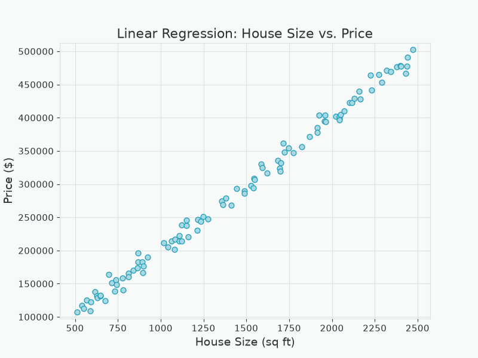
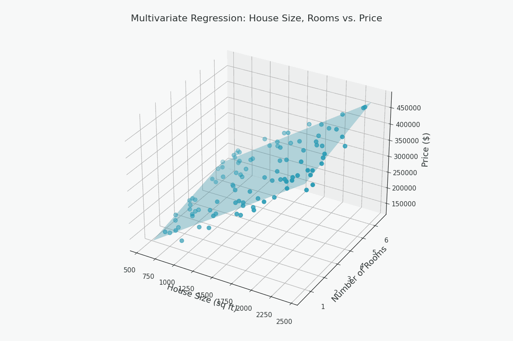
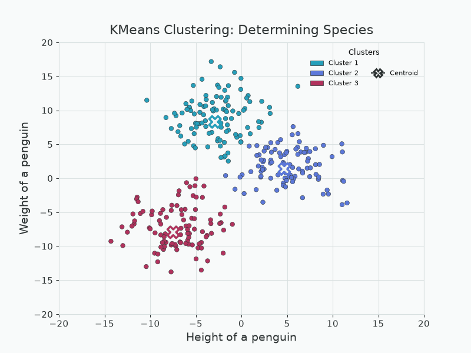
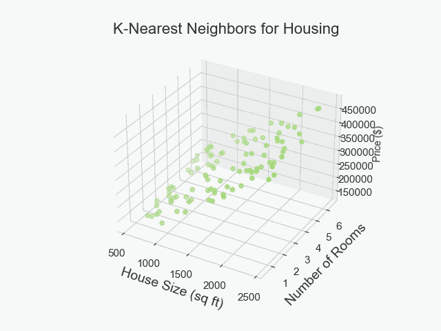
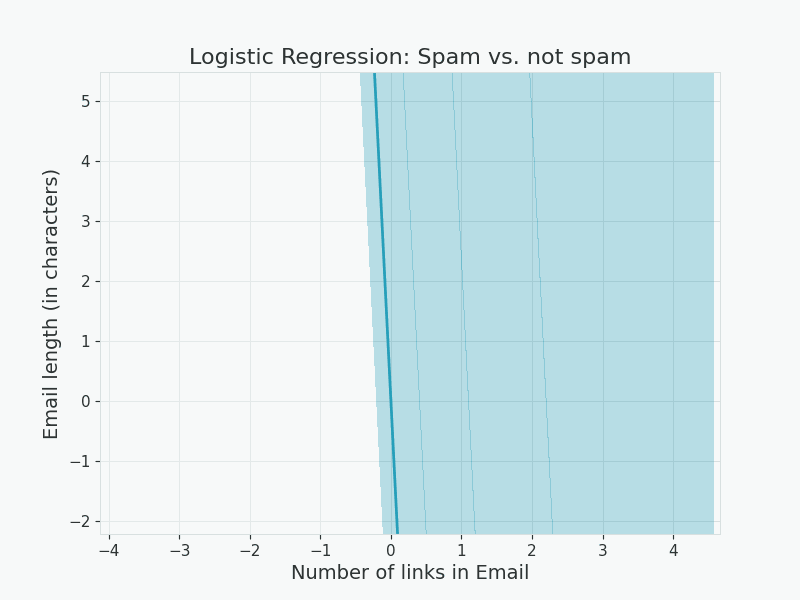
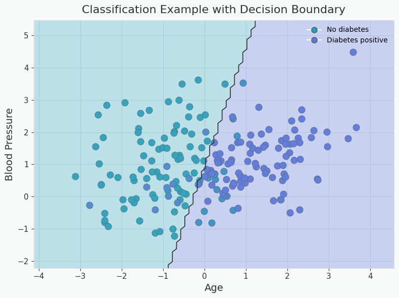

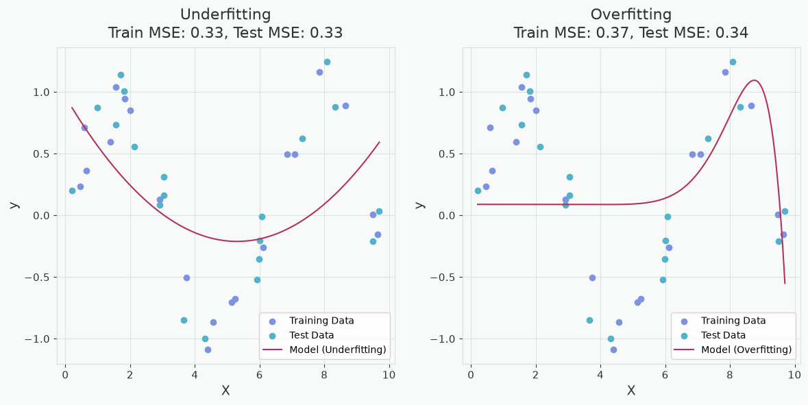
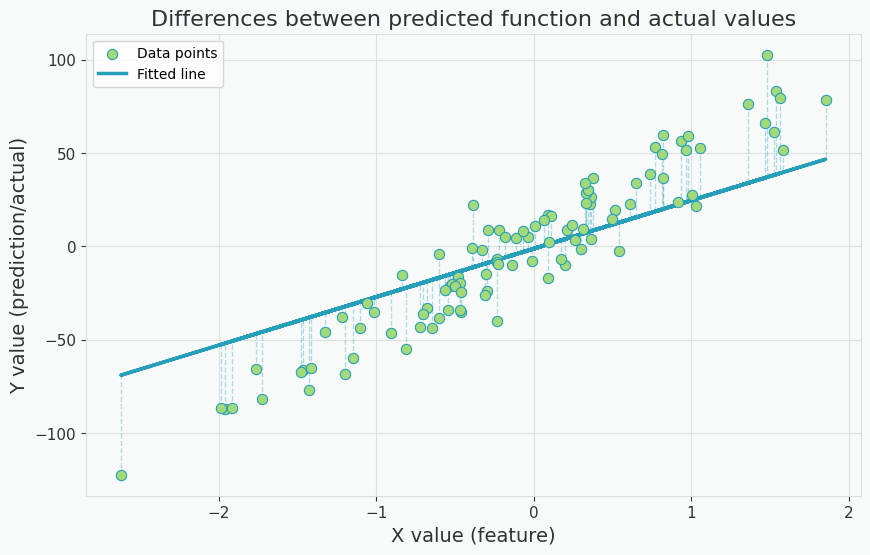
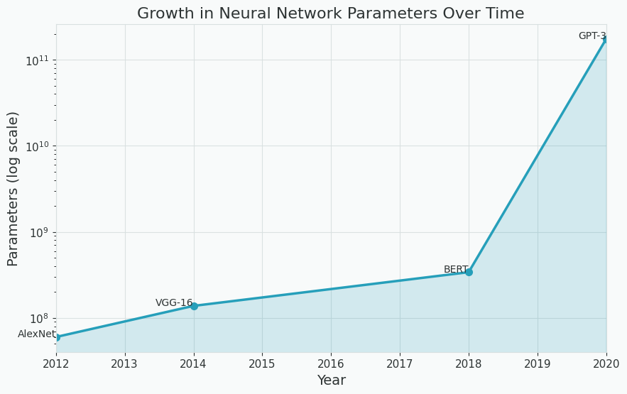
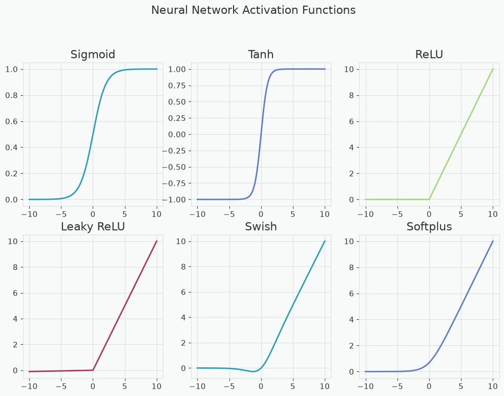
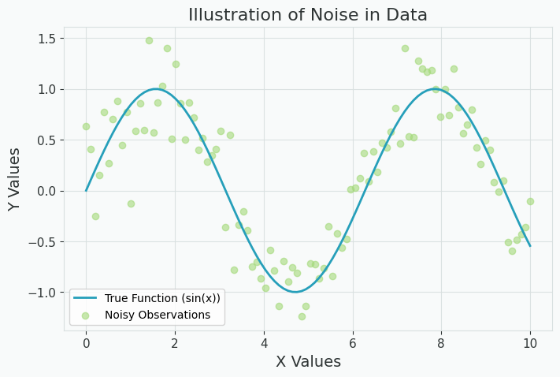
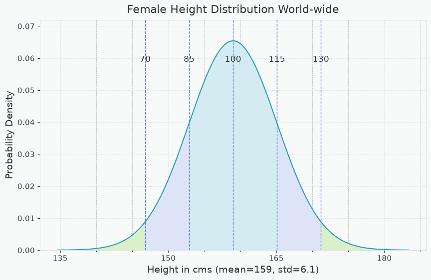
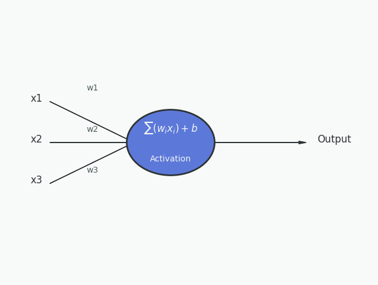
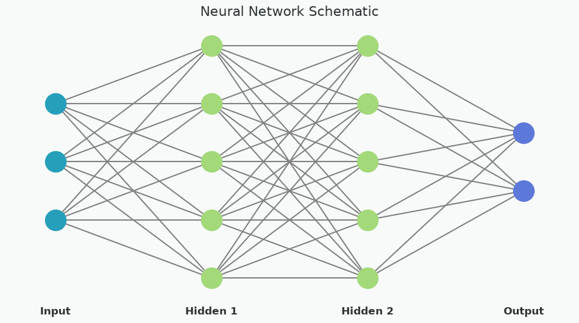
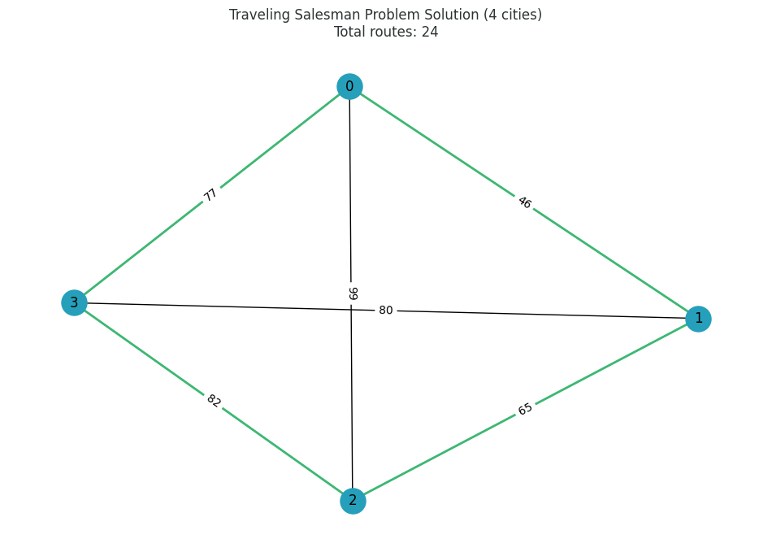
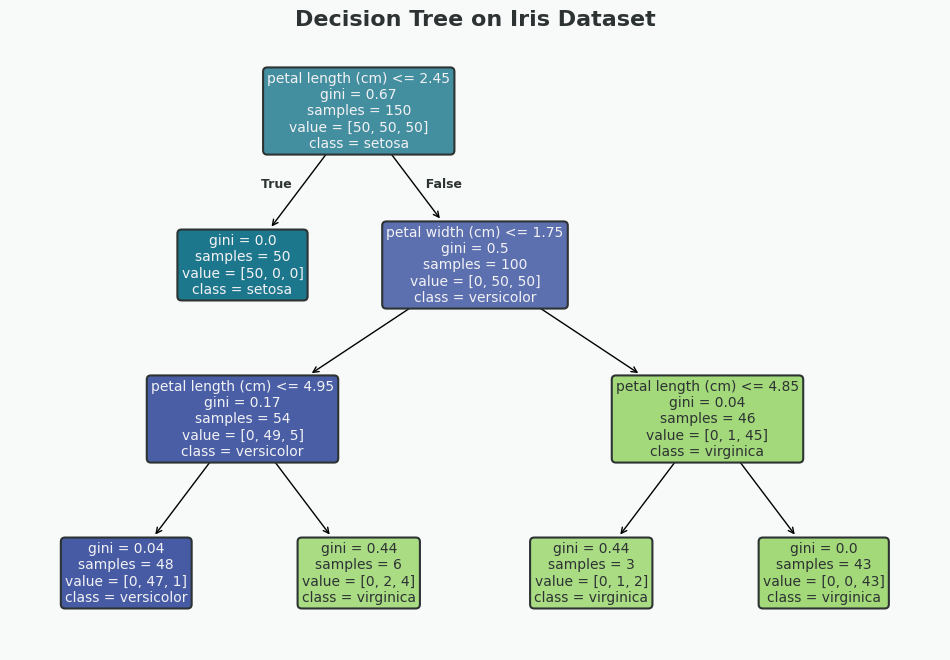
