# BitRoot AI Visuals

Teaching-focused plots and learning materials for AI and machine learning courses.

## About

This repository generates plots, diagrams, and code snippets used in AI
course materials.  All visuals are generated programmatically and styled
from the [Bitroot design system](bitroot.json).

> **AI agent instructions:** This repository contains `.agent-instructions/` —
> guidance that lets AI tools (such as Kilo) generate new diagrams, plots,
> and code snippets in the Bitroot style.  See the files in that directory
> for the details per medium.

## Contents

- [Python Plots](#python-plots) — matplotlib plots via CCPlots
- [Mermaid Diagrams](#mermaid-diagrams) — flowcharts via mmdc (`mermaid/` → `mermaid-output/`)
- [Code Snippets](#code-snippets) — syntax-highlighted code via carbon-now-cli (`code-snippets/` → `snippet-output/`)
- [Agent Instructions](#agent-instructions) — AI guidance for generating new content
- [Plot Showcase](#plot-showcase)

## Python Plots

The `CCPlots` module generates all plots in `plot-output/`.

1. Install dependencies: `pip install -r requirements.txt`
2. Regenerate all plots: `python generate_plots.py`
3. Or run a single example: `python -c "import CCPlots; CCPlots.<ClassName>().main()"` (see table below for class names)

Every example is a subclass of `PlotExample` (defined in `CCPlots/PlotExample.py`)
with a `CONFIG_KEY` that links it to its JSON config in `CCPlots/plot_configs/`.
All examples can be run via `generate_plots.py` uniformly.

### Configuration-driven

Each plot is configured by a JSON file in `CCPlots/plot_configs/`:
- Output filenames, figure size, DPI
- Locale-specific text labels (``text`` section)
- Semantic colour mappings (``colors`` section, optional)
- Plot-specific parameters (``params``, ``run`` sections)

To change a label or colour, edit the JSON — no Python code changes needed.

A global random seed (`GLOBAL_RANDOM_STATE = 42` in `CCPlots/config/`) is
used consistently by all examples for numpy, sklearn, and Python random calls.

### Localization

Every plot that supports text labels produces an English (EN) and Dutch (NL)
version. The EN filename has no suffix; the NL filename ends with `_NL`.
Text labels are stored in each plot's JSON config under a ``text`` key with
locale pairs `("en", "nl")`.

### Implementations

| Class | Config | Output |
|---|---|---|
| `Classification` | `classification.json` | `classification_decision_boundary.png`, `classification_confusion_matrix.png` |
| `ContinuousDiscrete` | `continuous_discrete.json` | `continuous_discrete.png` |
| `DecisionTree` | `decision_tree.json` | `decision_tree_iris.png` |
| `EmployeeAIAdoption` | `employee_ai_adoption.json` | `employee_ai_adoption.png` |
| `FraudDetection` | `fraud_detection.json` | `fraud_detection_boundary.png` |
| `KFolds` | `kfolds.json` | `kfold_validation.png` |
| `KMeans` | `kmeans.json` | `kmeans_animation_k3.gif`, `kmeans_clustering_k3.png` |
| `KNearest` | `knearest.json` | `knn_visualization_animation.gif` |
| `LLMPredict` | `llm_predict.json` | `llm_predict_next.png` |
| `LinearRegression` | `linear_regression.json` | `linear_regression_animation.gif` |
| `LogisticRegression` | `logistic_regression.json` | `logistic_regression_animation.gif` |
| `MSE` | `mse.json` | `mse_over_iterations.png` |
| `MSEZoom` | `mse_zoom.json` | `mse_zoom_iteration.png` |
| `MissingData` | `missing_data.json` | `missing_data_table.png` |
| `MultivariateRegression` | `multivariate_regression.json` | `multivariate_regression_animation.gif` |
| `NeuralNetSchematic` | `neural_net_schematic.json` | `neural_net_schematic.png` |
| `NeuralNetworkActivationFunctions` | `neural_network_activation_functions.json` | `neural_network_activation_functions.png` |
| `NeuralNetworkGrowth` | `neural_network_growth.json` | `neural_network_growth_line_log.png` |
| `NoisyData` | `noisy_data.json` | `noisy_data.png` |
| `NormalDistribution` | `normal_distribution.json` | `normal_distribution.png` |
| `OverfittingUnderfitting` | `overfitting_underfitting.json` | `overfitting_underfitting.png` |
| `Perceptron` | `perceptron.json` | `perceptron_schematic.png` |
| `Tokenization` | `tokenization.json` | `tokenization.png` |
| `TravelingSalesman` | `traveling_salesman.json` | `traveling_salesman_small_<n>_cities.png`, `traveling_salesman_large_<n>_cities.png` |

## Mermaid Diagrams

Source files (`.md`) live in `mermaid/`. Rendered SVG and PNG output is
written to `mermaid-output/`. Diagrams are styled with the Bitroot theme
derived from `bitroot.json` and rendered via the Mermaid CLI.

1. Install Node dependencies: `npm install`
2. Regenerate all diagrams: `python generate_mermaid.py`
3. Regenerate specific files: `python generate_mermaid.py topic.md topic_NL.md`

| Source (`mermaid/`) | Locales | Outputs (`mermaid-output/`) |
|---|---|---|
| `eu_ai_act_classification.md` | EN | `{stem}.svg`, `{stem}.png` |
| `eu_ai_act_classification_NL.md` | NL | `{stem}.svg`, `{stem}.png` |
| `eu_ai_act_timeline.md` | EN | `{stem}.svg`, `{stem}.png` |
| `eu_ai_act_timeline_NL.md` | NL | `{stem}.svg`, `{stem}.png` |
| `eu_ai_act_governance.md` | EN | `{stem}.svg`, `{stem}.png` |
| `eu_ai_act_governance_NL.md` | NL | `{stem}.svg`, `{stem}.png` |
| `eu_ai_act_nl_supervision.md` | EN | `{stem}.svg`, `{stem}.png` |
| `eu_ai_act_nl_supervision_NL.md` | NL | `{stem}.svg`, `{stem}.png` |
| `ml_algorithms_overview.md` | EN | `{stem}.svg`, `{stem}.png` |
| `ml_algorithms.md` | EN | `{stem}.svg`, `{stem}.png` |
| `scientific_method.md` | EN | `{stem}.svg`, `{stem}.png` |
| `cen_clc_tr_18115_data_management.md` | EN | `{stem}.svg`, `{stem}.png` |
| `cen_clc_tr_18115_data_management_NL.md` | NL | `{stem}.svg`, `{stem}.png` |

## Code Snippets

Python source files (`.py`) live in `code-snippets/` organised by topic.
Rendered screenshots (`.py.png`) are written to `snippet-output/`
mirroring the same subdirectory structure. Snippets are styled with the
Bitroot syntax-highlighting theme and rendered via carbon-now-cli.

1. Install Node dependencies: `npm install`
2. Regenerate all snippets: `python generate_snippets.py`

| Source (`code-snippets/`) | Contents | Outputs (`snippet-output/`) |
|---|---|---|
| `algorithms/` | sklearn API examples | `algorithms/*.py.png` |
| `exercise_snippets/` | Starter code for exercises | `exercise_snippets/*.py.png` |
| `finetuning/` | Grid search / hyperparameter tuning | `finetuning/*.py.png` |
| `model_selection/` | LazyPredict comparison output | `model_selection/*.py.png` |
| `preprocessing/` | Data cleaning, binning, normalization, etc. | `preprocessing/*.py.png` |

## Slide Bases

Text-free SVG and PNG base structures for presentations (PowerPoint, Google
Slides).  These are backdrops — you add labels and annotations on top in
your presentation tool.

All bases are generated from `bases/` (a standalone Python module, independent
from `CCPlots`).  Variants are configured in `bases_config.json`.

1. Install Node dependencies: `npm install`
2. Generate all bases: `python generate_bases.py`

| Generator | Variants | Outputs (`bases-output/`) |
|---|---|---|
| `pyramid` | 3, 4, 5 layers | `pyramid{suffix}.svg`, `.png` |
| `grid` | 2×2, 2×3, 3×1, 3×3 | `grid_{rows}x{cols}.svg`, `.png` |
| `timeline` | 3, 5, 7 ticks | `timeline_{n}.svg`, `.png` |
| `process` | 3, 4, 5 blocks | `process_{n}.svg`, `.png` |
| `layers` | 3, 4, 5 bars | `layers_{n}.svg`, `.png` |
| `venn` | 2, 3 sets | `venn_{n}.svg`, `.png` |

**Adding a new base?** The easiest way is an AI tool.  Use the prompt
template below, or read the full instructions in
`.agent-instructions/slide-bases.instructions.md`:

> Create a new base generator for [structure] in the `bases/` module.
> It should return an SVG styled with the Bitroot palette via
> `bases.palette.resolve_color()`.  Add variants to `bases_config.json`
> and register the generator in `generate_bases.py`.

The AI writes the generator, the config, and the registration — you just
run `python generate_bases.py` and the SVG/PNG appear in `bases-output/`.

## Styling

All visuals follow the **Bitroot** palette defined in
[`bitroot.json`](bitroot.json) (project root — the single source of truth).

| Token | Hex | Role |
|---|---|---|
| `primary` | `#269FBA` | Brand accent / node borders |
| `secondary` | `#5C78D9` | Connector lines / arrows |
| `tertiary` | `#A3D979` | Secondary node fills |
| `brand` | `#B1325D` | Emphatic accent (sparingly) |
| `surface` | `#F8FAFA` | Page / chart background |
| `on-surface` | `#2D3333` | Primary text colour |
| `on-surface-muted` | `#4D5C5C` | Secondary / muted text |
| `border` | `#D8E0E0` | Grid lines / borders |
| `white` | `#F2F2F5` | Card backgrounds / light contrast |

The palette is consumed by four theme modules — one per output type:

| Module | Config | Purpose |
|---|---|---|
| `CCPlots/config/palette.py` | `bitroot.json` | `BITROOT_PALETTE`, matplotlib styling, colour derivation |
| `CCPlots/config/mermaid_theme.py` | `bitroot.json` | `mmdc`-compatible theme for Mermaid diagrams |
| `CCPlots/config/carbon_theme.py` | `bitroot.json` | `carbon-now`-compatible theme for code snippets |

## Agent Instructions

This repository contains `.agent-instructions/` with guidance for AI tools
(Kilo, ChatGPT, Claude, Copilot, etc.) to generate new visuals in the
Bitroot style.

| File | Purpose |
|---|---|
| `plotting-style.instructions.md` | Adding matplotlib plots via the CCPlots pipeline |
| `mermaid-style.instructions.md` | Adding Mermaid diagrams (flowcharts, timelines) |
| `code-snippet-style.instructions.md` | Adding code examples via carbon-now |
| `slide-bases.instructions.md` | Generating text-free SVG bases for presentations |

**Getting started:** Copy the prompt from the file you need, hand it to an
AI tool, and let the AI generate the boilerplate.  Review the output and
run the corresponding `generate_*.py` script.

## Plot Showcase

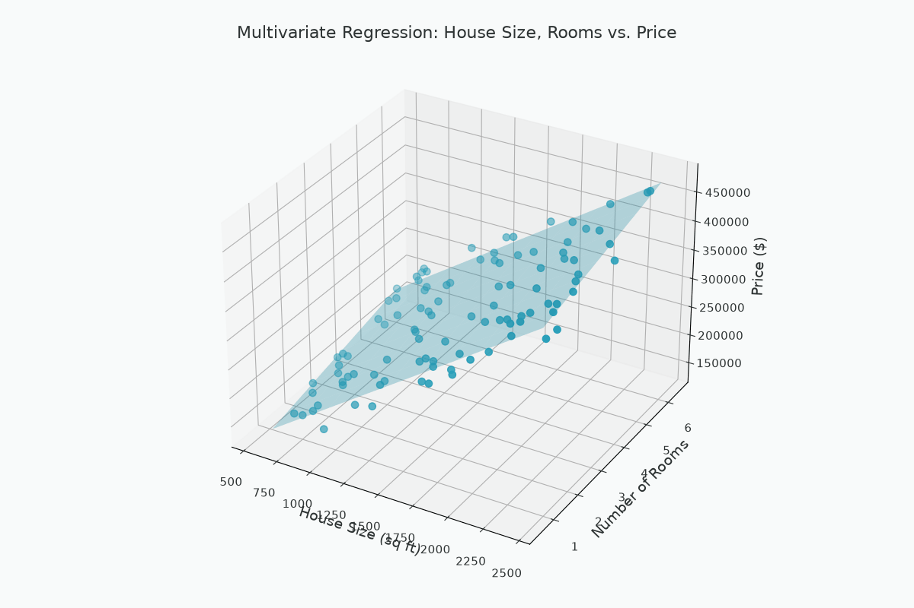

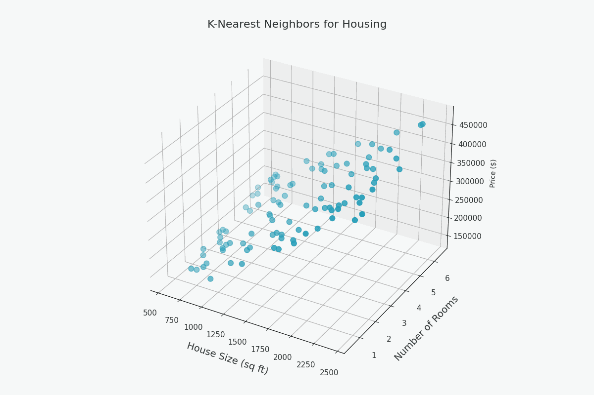
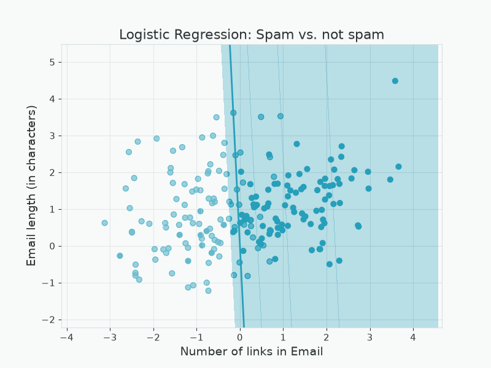
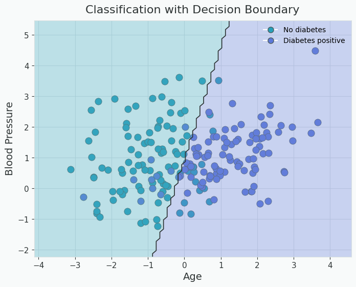
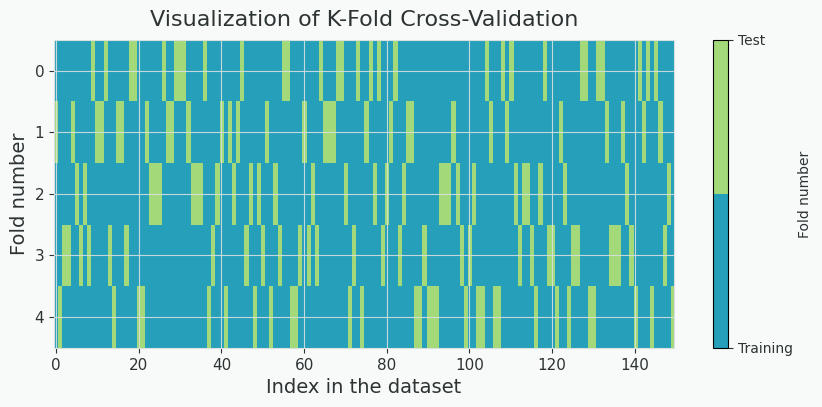
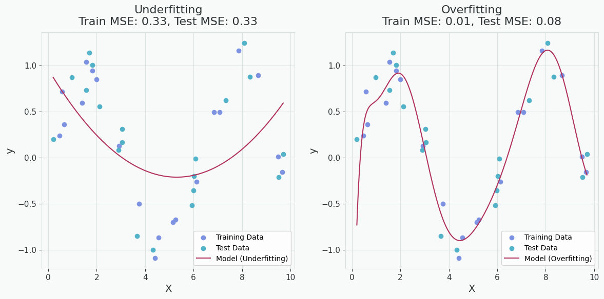
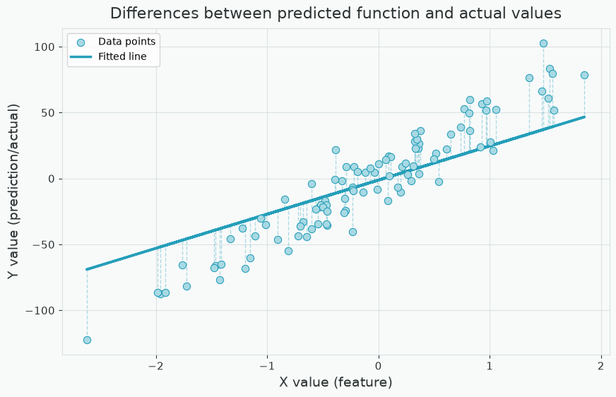
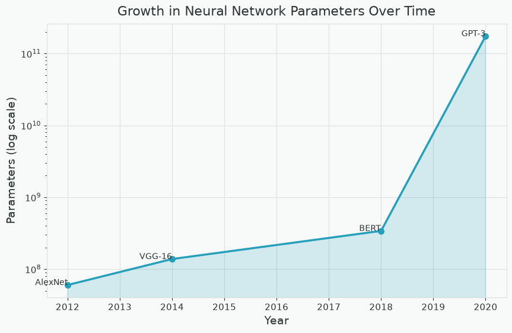
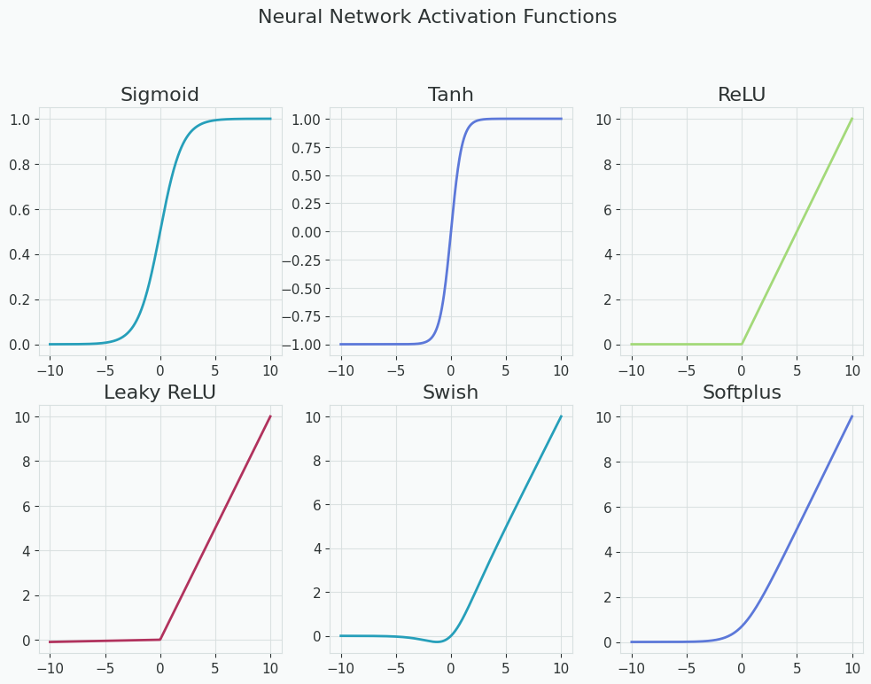
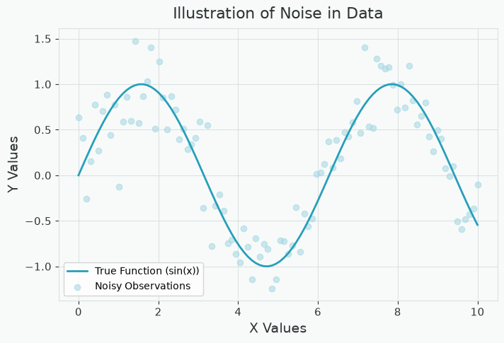

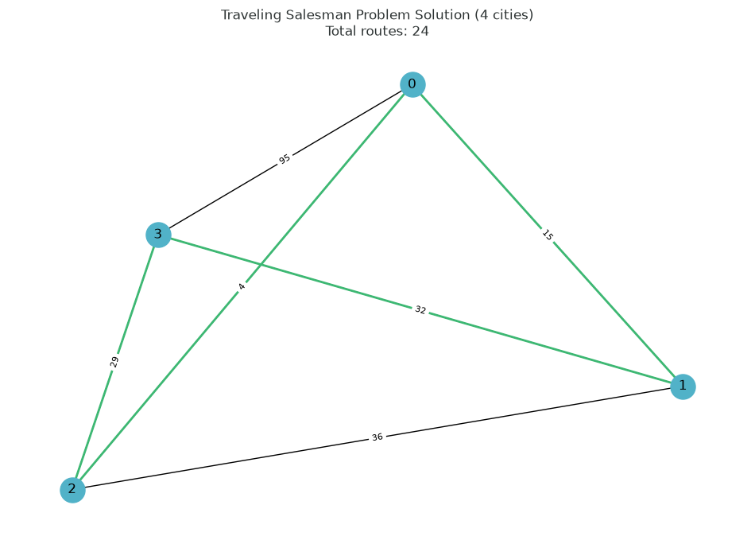

