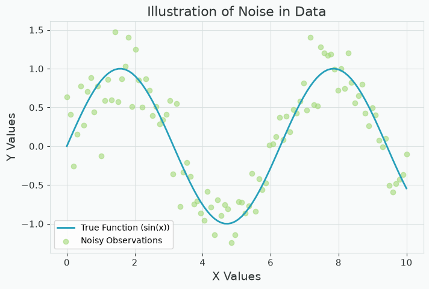
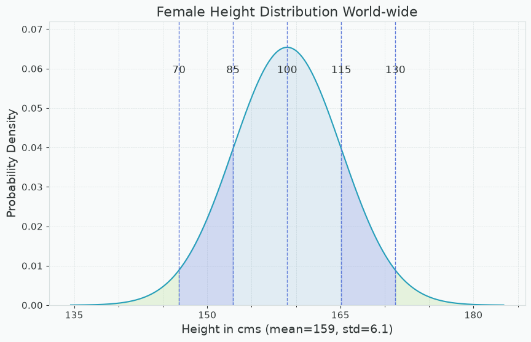
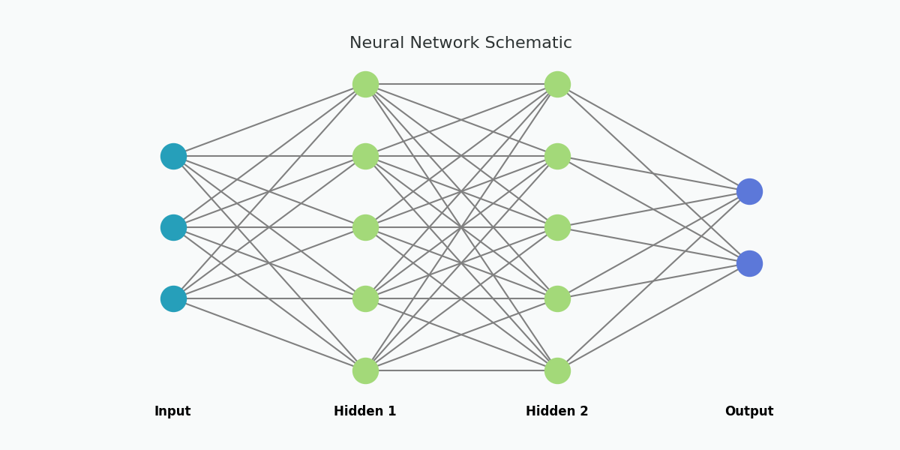
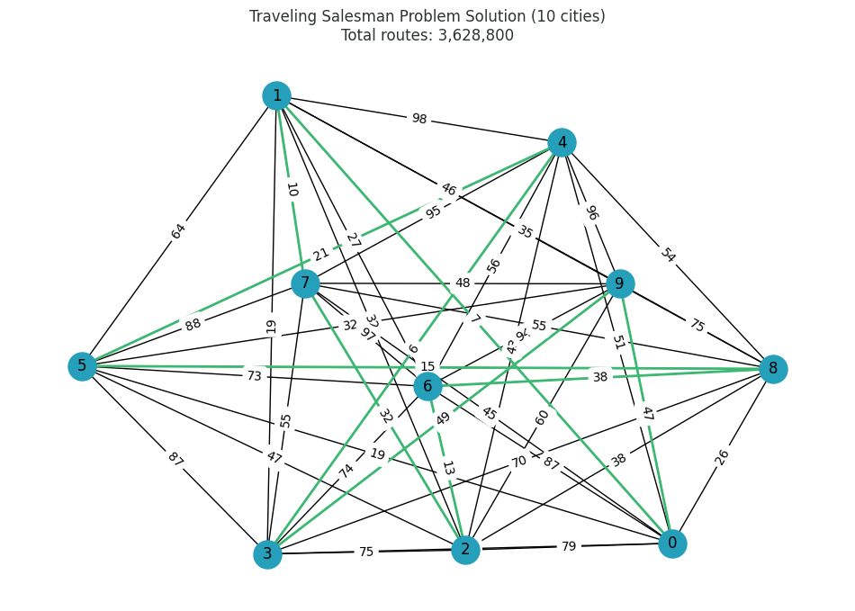

# BitRoot AI Visuals

Teaching-focused plots and learning materials for AI and machine learning courses.

## About

This repository generates plots, diagrams, and code snippets used in AI course
materials. All plots are generated programmatically via the `CCPlots` Python module,
ensuring consistent styling from the Bitroot design palette.

## Contents

- [Python Plots](#python-plots) — generated with CCPlots
- [Mermaid Diagrams](#mermaid-diagrams) — `.md` / `.svg` / `.png`
- [Code Snippets](#code-snippets) — ray.so renders (old style)
- [Plot Showcase](#plot-showcase)

## Python Plots

The `CCPlots` module generates all plots in `plots/`.

1. Install dependencies: `pip install -r requirements.txt`
2. Regenerate all plots: `python main.py`
3. Or run a single example: `python -c "from CCPlots.implementation.<ExampleName> import <ExampleName>; <ExampleName>().main()"`

Every example follows the `PlotExample` interface defined in
`CCPlots/PlotExample.py`, so all examples can be run via `main.py` uniformly.

### Localization

Every plot that supports text labels produces an English (EN) and Dutch (NL)
version. The EN filename has no suffix; the NL filename ends with `_NL`.
This is handled through a `TEXT_BY_LOCALE` dict with locale pairs `("en", "nl")`.

### Implementations

| Example | Output |
|---|---|
| ClassificationExample | `classification_decision_boundary.png`, `classification_confusion_matrix.png` |
| ContinuousDiscreteExample | `continuous_discrete_example.png` |
| DecisionTreeExample | `decision_tree_iris.png` |
| EmployeeAIAdoption | `employee_ai_adoption.png` |
| FraudDetection | `decision_boundary_fraud.png` |
| KFoldExample | `kfold_validation.png` |
| KMeansExample | `kmeans_animation_k3.gif`, `kmeans_clustering_k3.png`, etc. |
| KNearestExample | `knn_visualization_animation.gif` |
| LLMPredictExample | `llm_predict_next.png` |
| LinearRegressionExample | `linear_regression_animation.gif` |
| LogisticRegressionExample | `logistic_regression_animation.gif` |
| MSEExample | `mse_over_iterations.png` |
| MSEZoomExample | `mse_zoom_iteration.png` |
| MissingDataExample | `naturally_missing_data_table.png` |
| MultivariateRegressionExample | `multivariate_regression_animation.gif` |
| NeuralNetSchematic | `nn_schematic.png` |
| NeuralNetworkActivationFunctionsExample | `neural_network_activation_functions.png` |
| NeuralNetworkGrowthExample | `neural_network_growth_line_log.png` |
| NoisyDataExample | `noisy_data_example.png` |
| OverfittingUnderfittingExample | `overfitting_underfitting.png` |
| PerceptronExample | `perceptron_schematic.png` |
| RegressionExample | `regression_example.png` |
| TokenizationExample | `tokenization_example.png` |
| TravelingSalesmanVisualization | `tsp_small_<n>_cities.png`, `tsp_large_<n>_cities.png` |

## Mermaid Diagrams

The `mermaid/` folder stores Mermaid diagram source (`.md`), rendered SVG,
and PNG exports. Topics include:

- EU AI Act classification
- Machine learning algorithms overview
- Scientific method flowchart

## Code Snippets

The `ray.so_images/` folder contains code snippet screenshots generated with
[ray.so](https://ray.so). These accompany the course slides.

Settings: Theme `meadow`, Background off, Margin 16px, Languages Python / Markdown.

### Subdirectories

| Folder | Contents |
|---|---|
| `algorithms/` | sklearn API examples (clustering, trees, regression, SVM, etc.) |
| `exercise_snippets/` | Starter code for exercises (e.g. Titanic import) |
| `finetuning/` | Grid search / hyperparameter tuning examples |
| `model_selection/` | LazyPredict comparison output |
| `preprocessing/` | Data cleaning, binning, normalization, encoding, etc. |

## Styling

All visuals follow the **Bitroot** palette defined in
[`colour_reference.md`](colour_reference.md) and
[`CCPlots/config.py`](CCPlots/config.py).

| Role | Hex |
|---|---|
| Primary (Cyan) | `#269FBA` |
| Secondary (Purple) | `#5C78D9` |
| Tertiary (Green) | `#A3D979` |
| Highlight (Beet) | `#B1325D` |
| Background | `#F8FAFA` |
| Text | `#2D3333` |

Use the `apply_bitroot_style()` helper in `CCPlots/config.py` to apply the
palette defaults to any Matplotlib axis.

## Plot Showcase

