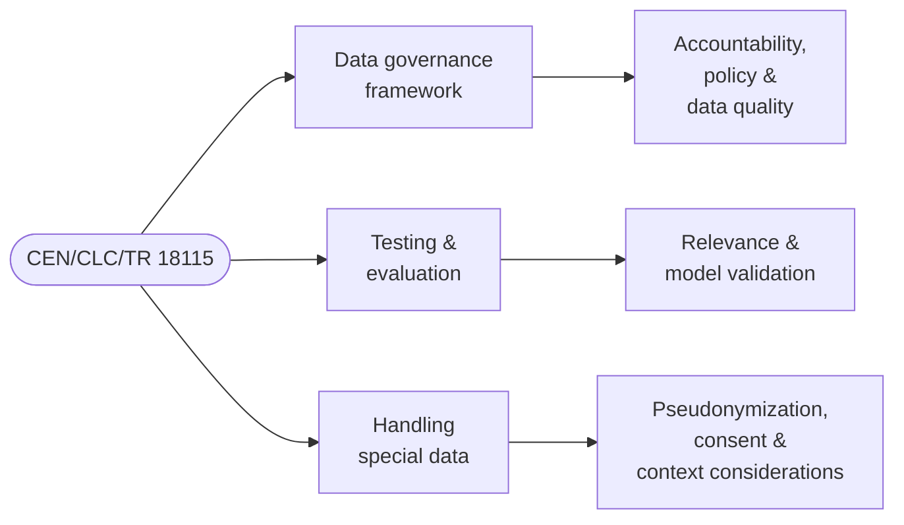

```mermaid
flowchart LR
    Start(["CEN/CLC/TR 18115"])

    Governance["Data governance<br/>framework"]
    Evaluatie["Testing &<br/>evaluation"]
    SpecialeData["Handling<br/>special data"]

    GovDetails["Accountability,<br/>policy &<br/>data quality"]
    EvalDetails["Relevance &<br/>model validation"]
    SpecDetails["Pseudonymization,<br/>consent &<br/>context considerations"]

    Start --> Governance
    Start --> Evaluatie
    Start --> SpecialeData

    Governance --> GovDetails
    Evaluatie --> EvalDetails
    SpecialeData --> SpecDetails
```
