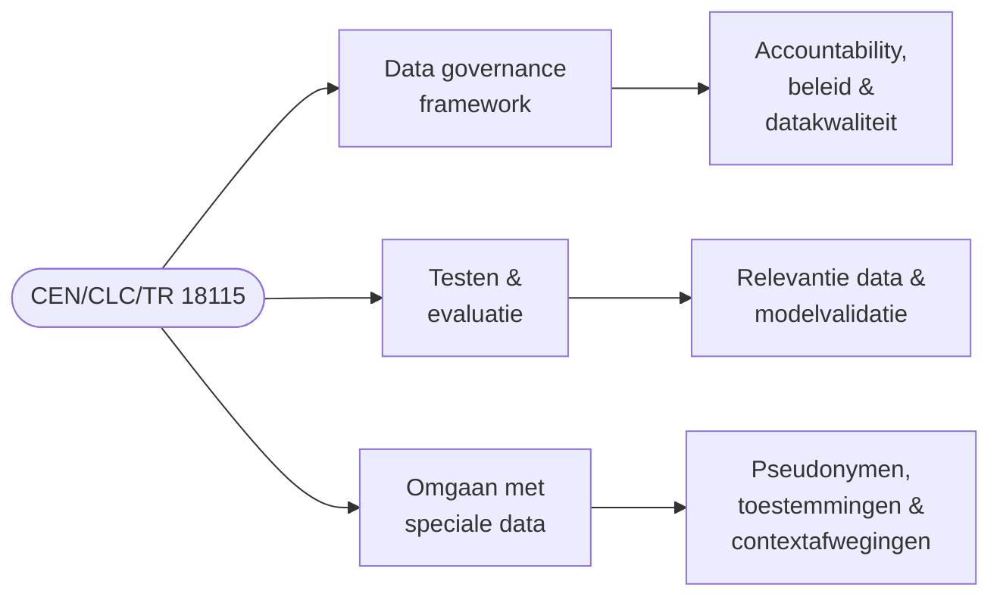

```mermaid
flowchart LR
    Start(["CEN/CLC/TR 18115"])

    Governance["Data governance<br/>framework"]
    Evaluatie["Testen &<br/>evaluatie"]
    SpecialeData["Omgaan met<br/>speciale data"]

    GovDetails["Accountability,<br/>beleid &<br/>datakwaliteit"]
    EvalDetails["Relevantie data &<br/>modelvalidatie"]
    SpecDetails["Pseudonymen,<br/>toestemmingen &<br/>contextafwegingen"]

    Start --> Governance
    Start --> Evaluatie
    Start --> SpecialeData

    Governance --> GovDetails
    Evaluatie --> EvalDetails
    SpecialeData --> SpecDetails
```
