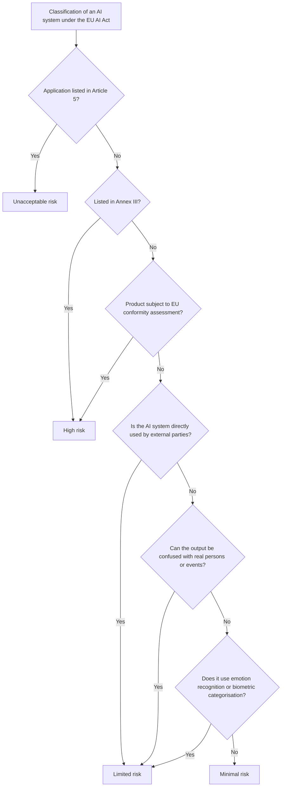

```mermaid
flowchart TD

A[Classification of an AI system under the EU AI Act] --> B{Application listed in Article 5?}
B -->|Yes| R1[Unacceptable risk]
B -->|No| C{Listed in Annex III?}

C -->|Yes| R2[High risk]
C -->|No| D{Product subject to EU conformity assessment?}

D -->|Yes| R2[High risk]
D -->|No| Q1{Is the AI system directly used by external parties?}

%% Transparency sub-questions
Q1 -->|Yes| R3[Limited risk]
Q1 -->|No| Q2{Can the output be confused with real persons or events?}

Q2 -->|Yes| R3[Limited risk]
Q2 -->|No| Q3{Does it use emotion recognition or biometric categorisation?}

Q3 -->|Yes| R3[Limited risk]
Q3 -->|No| R4[Minimal risk]
```
