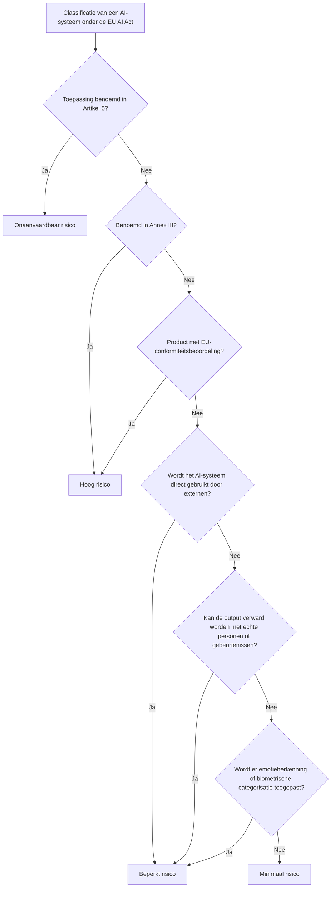

```mermaid
flowchart TD

A[Classificatie van een AI-systeem onder de EU AI Act] --> B{Toepassing benoemd in Artikel 5?}
B -->|Ja| R1[Onaanvaardbaar risico]
B -->|Nee| C{Benoemd in Annex III?}

C -->|Ja| R2[Hoog risico]
C -->|Nee| D{Product met EU-conformiteitsbeoordeling?}

D -->|Ja| R2[Hoog risico]
D -->|Nee| Q1{Wordt het AI-systeem direct gebruikt door externen?}

%% Transparantie-subvragen
Q1 -->|Ja| R3[Beperkt risico]
Q1 -->|Nee| Q2{Kan de output verward worden met echte personen of gebeurtenissen?}

Q2 -->|Ja| R3[Beperkt risico]
Q2 -->|Nee| Q3{Wordt er emotieherkenning of biometrische categorisatie toegepast?}

Q3 -->|Ja| R3[Beperkt risico]
Q3 -->|Nee| R4[Minimaal risico]
```