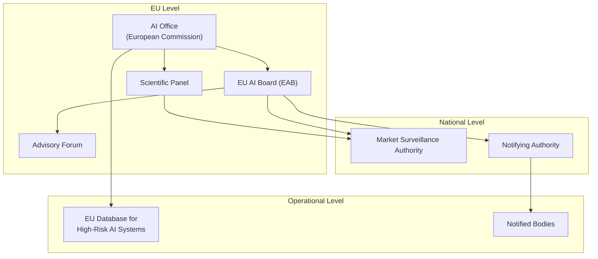

```mermaid
flowchart TB

    AIOffice["AI Office<br/>(European Commission)"]
    ScientificPanel["Scientific Panel"]
    EUAIBoard["EU AI Board (EAB)"]
    AdvisoryForum["Advisory Forum"]

    MarketSurveillance["Market Surveillance Authority"]
    NotifyingAuthority["Notifying Authority"]

    EUDatabase["EU Database for<br/>High-Risk AI Systems"]
    NotifiedBodies["Notified Bodies"]

    AIOffice --> EUAIBoard
    AIOffice --> ScientificPanel

    ScientificPanel --> MarketSurveillance
    EUAIBoard --> MarketSurveillance
    EUAIBoard --> NotifyingAuthority
    EUAIBoard --> AdvisoryForum

    AIOffice --> EUDatabase
    NotifyingAuthority --> NotifiedBodies

    subgraph EU_Level["EU Level"]
        AIOffice
        ScientificPanel
        EUAIBoard
        AdvisoryForum
    end

    subgraph National_Level["National Level"]
        MarketSurveillance
        NotifyingAuthority
    end

    subgraph Operational_Level["Operational Level"]
        EUDatabase
        NotifiedBodies
    end
```
