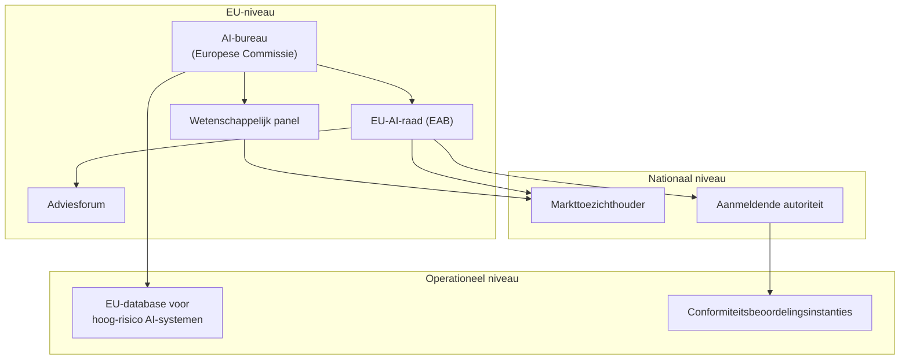

```mermaid
flowchart TB

    AIBureau["AI-bureau<br/>(Europese Commissie)"]
    WetenschappelijkPanel["Wetenschappelijk panel"]
    AIRaad["EU-AI-raad (EAB)"]
    Adviesforum["Adviesforum"]

    Markttoezichthouder["Markttoezichthouder"]
    AanmeldendeAutoriteit["Aanmeldende autoriteit"]

    EUDatabase["EU-database voor<br/>hoog-risico AI-systemen"]
    Conformiteitsinstanties["Conformiteitsbeoordelingsinstanties"]

    AIBureau --> AIRaad
    AIBureau --> WetenschappelijkPanel

    WetenschappelijkPanel --> Markttoezichthouder
    AIRaad --> Markttoezichthouder
    AIRaad --> AanmeldendeAutoriteit
    AIRaad --> Adviesforum

    AIBureau --> EUDatabase
    AanmeldendeAutoriteit --> Conformiteitsinstanties

    subgraph EU_Niveau["EU-niveau"]
        AIBureau
        WetenschappelijkPanel
        AIRaad
        Adviesforum
    end

    subgraph Nationaal_Niveau["Nationaal niveau"]
        Markttoezichthouder
        AanmeldendeAutoriteit
    end

    subgraph Operationeel_Niveau["Operationeel niveau"]
        EUDatabase
        Conformiteitsinstanties
    end
```
