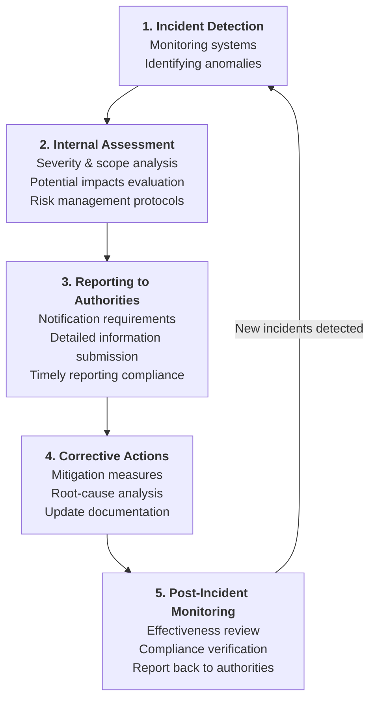

```mermaid
flowchart TD

    A["<b class='hl'>1. Incident Detection</b><br/>Monitoring systems<br/>Identifying anomalies"]

    B["<b class='hl'>2. Internal Assessment</b><br/>Severity & scope analysis<br/>Potential impacts evaluation<br/>Risk management protocols"]

    C["<b class='hl'>3. Reporting to Authorities</b><br/>Notification requirements<br/>Detailed information submission<br/>Timely reporting compliance"]

    D["<b class='hl'>4. Corrective Actions</b><br/>Mitigation measures<br/>Root-cause analysis<br/>Update documentation"]

    E["<b class='hl'>5. Post-Incident Monitoring</b><br/>Effectiveness review<br/>Compliance verification<br/>Report back to authorities"]

    A --> B
    B --> C
    C --> D
    D --> E
    E -->|New incidents detected| A
```
