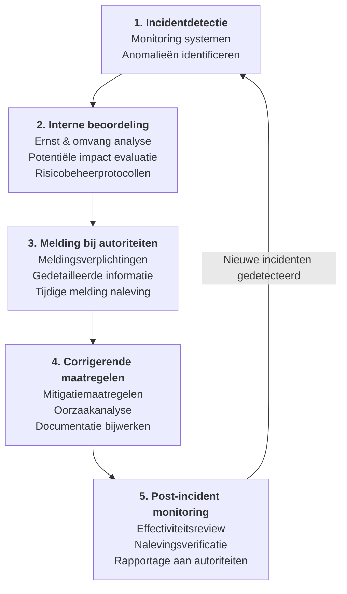

```mermaid
flowchart TD

    A["<b class='hl'>1. Incidentdetectie</b><br/>Monitoring systemen<br/>Anomalieën identificeren"]

    B["<b class='hl'>2. Interne beoordeling</b><br/>Ernst & omvang analyse<br/>Potentiële impact evaluatie<br/>Risicobeheerprotocollen"]

    C["<b class='hl'>3. Melding bij autoriteiten</b><br/>Meldingsverplichtingen<br/>Gedetailleerde informatie<br/>Tijdige melding naleving"]

    D["<b class='hl'>4. Corrigerende maatregelen</b><br/>Mitigatiemaatregelen<br/>Oorzaakanalyse<br/>Documentatie bijwerken"]

    E["<b class='hl'>5. Post-incident monitoring</b><br/>Effectiviteitsreview<br/>Nalevingsverificatie<br/>Rapportage aan autoriteiten"]

    A --> B
    B --> C
    C --> D
    D --> E
    E -->|Nieuwe incidenten gedetecteerd| A
```
