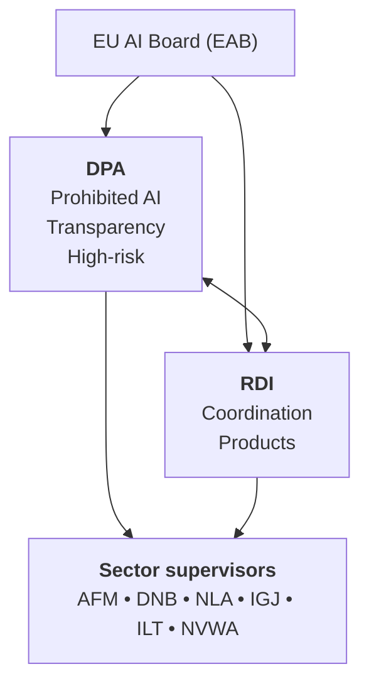

```mermaid
flowchart TB

    EAB["EU AI Board (EAB)"]

    AP["<b class='hl'>DPA</b><br/>Prohibited AI<br/>Transparency<br/>High-risk"]

    RDI["<b class='hl'>RDI</b><br/>Coordination<br/>Products"]

    Sector["<b class='hl'>Sector supervisors</b><br/>AFM • DNB • NLA • IGJ • ILT • NVWA"]

    EAB --> AP
    EAB --> RDI

    AP <--> RDI

    AP --> Sector
    RDI --> Sector
```
