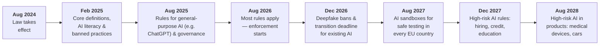

```mermaid
flowchart LR
    A["<b class='hl'>Aug 2024</b><br>Law takes<br>effect"] --> B["<b class='hl'>Feb 2025</b><br>Core definitions,<br>AI literacy &<br>banned practices"]
    B --> C["<b class='hl'>Aug 2025</b><br>Rules for general-<br>purpose AI (e.g.<br>ChatGPT) & governance"]
    C --> D["<b class='hl'>Aug 2026</b><br>Most rules apply<br>— enforcement<br>starts"]
    D --> E["<b class='hl'>Dec 2026</b><br>Deepfake bans &<br>transition deadline<br>for existing AI"]
    E --> F["<b class='hl'>Aug 2027</b><br>AI sandboxes for<br>safe testing in<br>every EU country"]
    F --> G["<b class='hl'>Dec 2027</b><br>High-risk AI rules:<br>hiring, credit,<br>education"]
    G --> H["<b class='hl'>Aug 2028</b><br>High-risk AI in<br>products: medical<br>devices, cars"]
```
