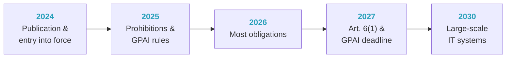

```mermaid
flowchart LR
    A["<b style='color:#269FBA'>2024</b><br>Publication &<br>entry into force"] --> B["<b style='color:#269FBA'>2025</b><br>Prohibitions &<br>GPAI rules"]
    B --> C["<b style='color:#269FBA'>2026</b><br>Most obligations"]
    C --> D["<b style='color:#269FBA'>2027</b><br>Art. 6(1) &<br>GPAI deadline"]
    D --> E["<b style='color:#269FBA'>2030</b><br>Large-scale<br>IT systems"]
```
