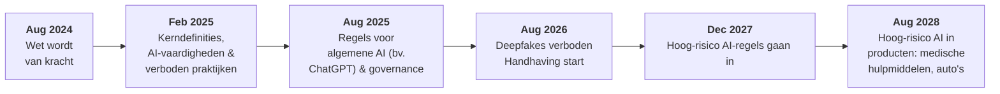

```mermaid
flowchart LR
    A["<b class='hl'>Aug 2024</b><br>Wet wordt<br>van kracht"] --> B["<b class='hl'>Feb 2025</b><br>Kerndefinities,<br>AI-vaardigheden &<br>verboden praktijken"]
    B --> C["<b class='hl'>Aug 2025</b><br>Regels voor<br>algemene AI (bv.<br>ChatGPT) & governance"]
    C --> D["<b class='hl'>Aug 2026</b><br>Deepfakes verboden<br>Handhaving start"]
    D --> E["<b class='hl'>Dec 2027</b><br>Hoog-risico AI-regels gaan in"]
    E --> F["<b class='hl'>Aug 2028</b><br>Hoog-risico AI in<br>producten: medische<br>hulpmiddelen, auto's"]
```
