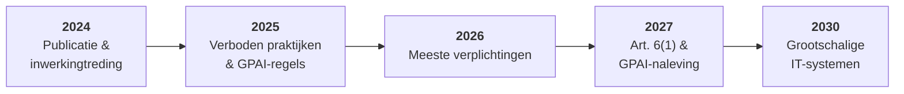

```mermaid
flowchart LR
    A["<b class='hl'>2024</b><br>Publicatie &<br>inwerkingtreding"] --> B["<b class='hl'>2025</b><br>Verboden praktijken<br>& GPAI-regels"]
    B --> C["<b class='hl'>2026</b><br>Meeste verplichtingen"]
    C --> D["<b class='hl'>2027</b><br>Art. 6(1) &<br>GPAI-naleving"]
    D --> E["<b class='hl'>2030</b><br>Grootschalige<br>IT-systemen"]
```
