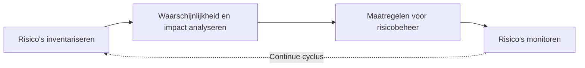

```mermaid
flowchart LR

    A["Risico's inventariseren"]:::step
    B["Waarschijnlijkheid en impact analyseren"]:::step
    C["Maatregelen voor risicobeheer"]:::step
    D["Risico's monitoren"]:::step

    A --> B
    B --> C
    C --> D

    D -. "Continue cyclus" .-> A
```
