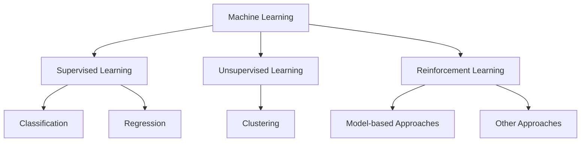

```mermaid
graph TD
    A[Machine Learning]:::main

    A --> B[Supervised Learning]:::section
    A --> C[Unsupervised Learning]:::section
    A --> D[Reinforcement Learning]:::section
    
    %% Supervised Learning Branch
    B --> B1[Classification]:::subsection
    B --> B2[Regression]:::subsection
    
    C --> C1[Clustering]:::subsection
    
    D --> D1[Model-based Approaches]:::subsection
    D --> D2[Other Approaches]:::subsection
```